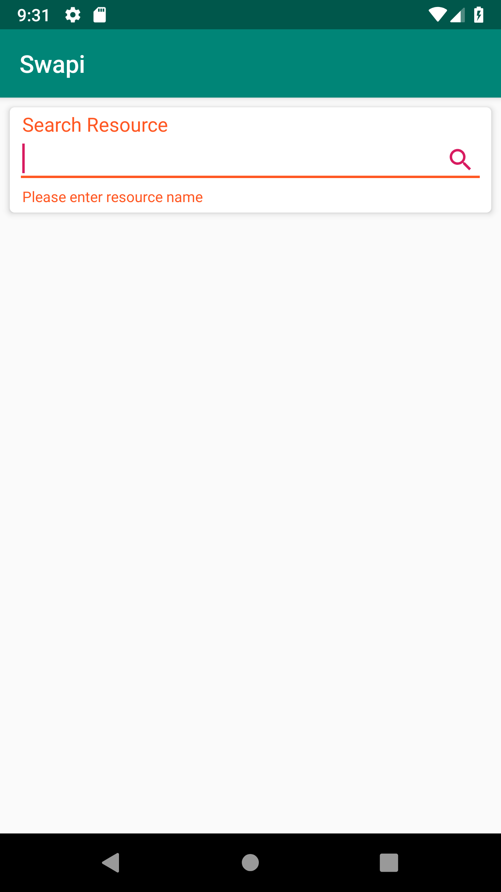
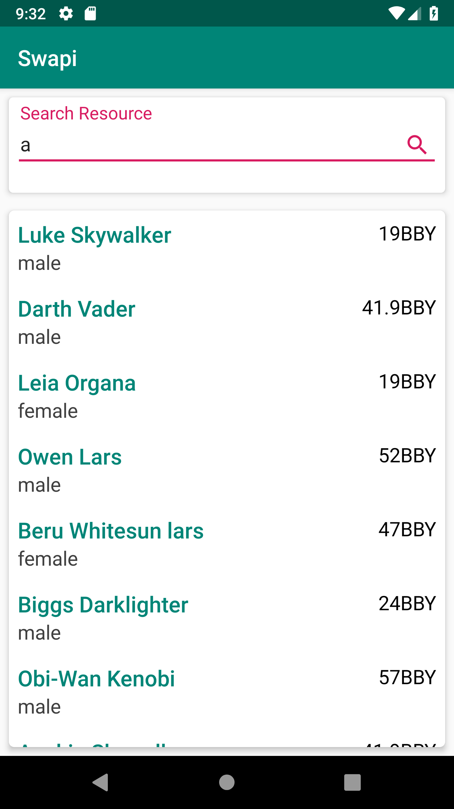
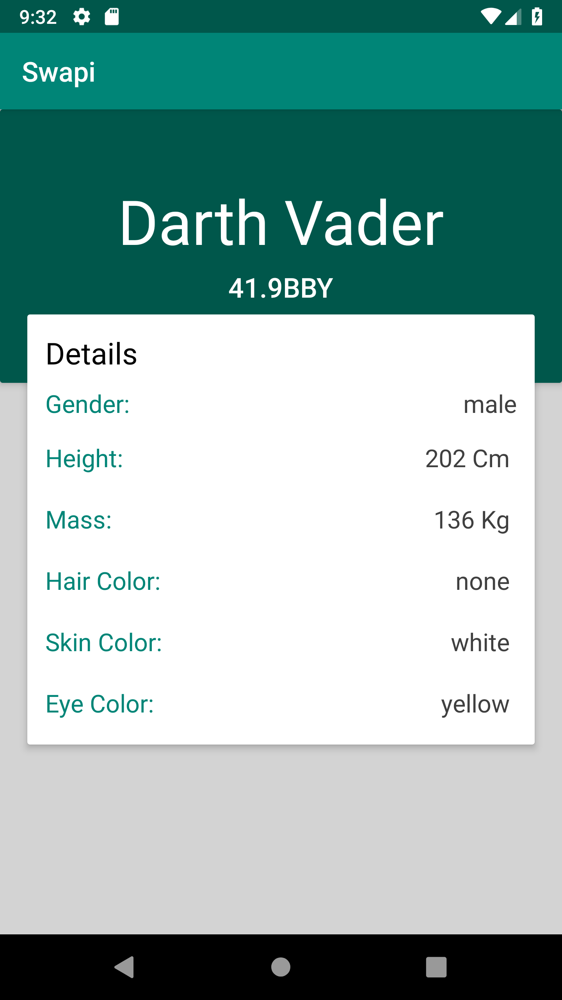
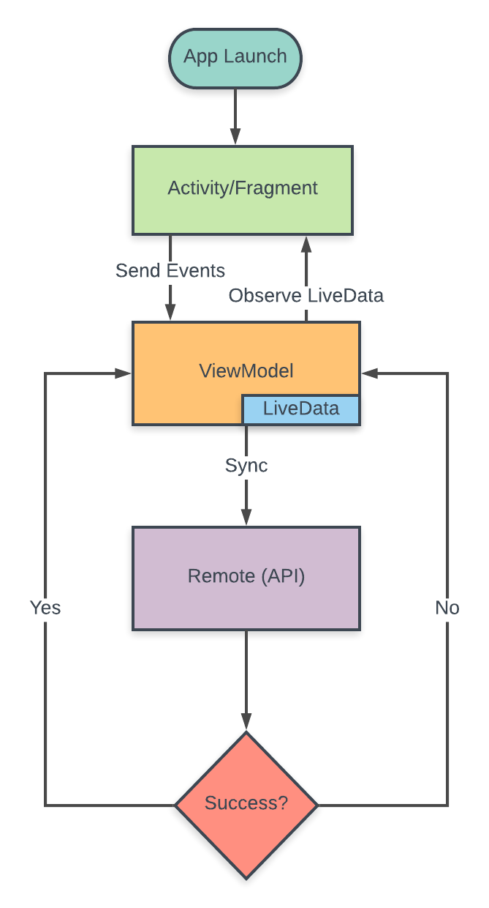

# Swapi
* A sample Android app to play with http://swapi.co/ API.
* Search resources with "/people" endpoint.
* Application made with android architecture component, third party libraries and with MVVM design pattern.

# Features

Some of the features of the app include

* Effective Networking - Using a combination of Retrofit, RxJava and LiveData, we are able to handle networking in the most effective way.

* MVVM architecture - Using the lifecycle aware viewmodels, the view observes changes in the model.

* Android Architecture Components - Lifecycle awareness has been achieved using a combination of LiveData, ViewModels. Integrate Navigation component for smooth navigation between screens(https://github.com/vandit067/Swapi/tree/Navigation_Architecture_Component_Integration)

* View Bindings - Bind views using butterknife.

# Demo

# Networking

# BuildInfo
* Android Studio - 3.2.1
* Compile SDK - 28
* Min SDK - 21
* Target SDK - 28

# Libraries
* <a href="https://developer.android.com/jetpack/androidx/">AndroidX Support Libraries</a>
* <a href="http://square.github.io/retrofit/">Retrofit</a>
* <a href="http://square.github.io/okhttp/">OkHttp</a>
* <a href="https://developer.android.com/topic/libraries/architecture/viewmodel">ViewModel</a>
* <a href="https://developer.android.com/topic/libraries/architecture/livedata">LiveData</a>
* <a href="https://developer.android.com/topic/libraries/architecture/navigation/">Navigation</a>
* <a href="https://github.com/ReactiveX/RxJava">RxJava</a>
* <a href="https://github.com/ReactiveX/RxAndroid">RxAndroid</a>
* <a href="https://github.com/JakeWharton/butterknife">ButterKnife</a>
